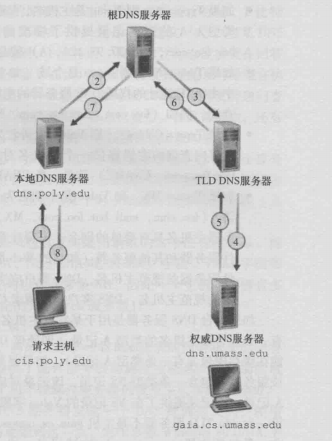

## DNS

### 概览

DNS 是一个由分层的 DNS 服务器实现的分布式数据库,一个使得主机能够查询分布式数据库的应用层协议

DNS 通常是由其他应用层协议所使用的,包括 HTTP,SMTP 和 FTP,将用户提供的主机名解析为 IP 地址。例如我们要将一个 HTTP 请求报文发送到`WEB`服务器`www.someschool.edu`,该用户主机必须获得`www.someschool.edu`的 IP 地址,其做法如下:

- 同一台用户主机上运行这 DNS 应用的客户端
- 浏览器从上述 URL 中抽取出主机名`www.someschool.edu`,并将这台主机名传给 DNS 应用的客户端
- DNS 客户向 DNS 服务器发送一个包含主机名的请求
- DNS 客户最终会收到一份回答报文,其中含有对应于该主机名的 IP 地址
- 一旦浏览器接收到来自 DNS 的该 IP 地址,他能够向位该 IP 地址 80 端口的 HTTP 服务进程发起一个 TCP 连接

除了进行主机到 IP 地址的转换外,DNS 还提供了一些重要的服务

- 主机别名: 有着复杂主机名的主机能拥有一个或者多个别名。应用程序可以调用 DNS 来获得主机别名对应的规范主机名以及主机名的 IP 地址

- 邮件服务器别名: 电子邮件地应用程序可以调用 DNS,对提供的邮件服务器别名进行解析,以获得该主机的规范主机名及其 IP 地址。

- 负载分配: DNS 也用于在冗余的服务器(如冗余的 Web 服务器)之间进行负载分配。繁忙的站点被冗余分布在多台服务器上,每台服务器据运行在不同的端系统上,每个都有着不同的 IP 地址。由于这些冗余的`Web`服务器,一个 IP 地址结合因此与同一个规范主机名和联系。DNS 数据库中存储着这些 IP 地址集合。当客户对映射到某地址集合的名字发出一个 DNS 请求时,该服务器用 IP 地址的整个集合进行响应,但在每个回答中循环这些地址次序。因为客户对通常总是向 IP 地址排在最前面的服务器发送 HTTP 请求报文,所以 DNS 就在所有这些冗余的 Web 服务器之间循环分配了负载。

## DNS 工作机理

1.  分布式,层次数据库

为了处理扩展性问题,DNS 使用了大量的 DNS 服务器,他们以层次方式组织,并且分布在全世界范围内。没有一台 DNS 服务器拥有因特网上所有主机的映射。相反,该映射分布在所有的 DNS 服务器上。一般有四种类型的 DNS 服务器

- 根 DNS 服务器:

根 DNS 服务器提供了顶级域 DNS 服务器的 IP 地址

- 顶级域(DNS)服务器:

这些服务器负责顶级域名如`com`,`org`,`net`等,会返回权威服务器的 IP 地址

- 权威 DNS 服务器:

在因特网上具有公共可访问主机(如 Web 服务器和邮件服务器)的每个组织及后都必须提供公共可访问的 DNS 记录,这些记录将这些主机的名字映射为 IP 地址。

- 本地 DNS 服务器:

每个 ISP 都有一台本地 DNS 服务器,当主机与某个 ISP 连接时,该 ISP 提供了一台主机的 IP 地址,该主机具有一台或多台其本地 DNS 服务器的 IP 地址,而本地 DNS 服务器会起到代理的作用,将报文转发到上面三种类型的 DNS 服务器层次结构中去

如图所示,主机向本地服务器发送 DNS 查询报文,该查询报文中含有被转换的主机名。本地服务器将该报文转发到根 DNS 服务器。该根 DNS 服务器注意到`edu`前缀并向本地 DNS 服务器返回负责`edu`的 TLD 的 IP 地址列表。该本地 DNS 服务器则再次想这些 TLD 服务器之一发送查询报文。该 TLD 服务器注意到`umass.edu`前缀,并用权威 DNS 服务器的 IP 地址进行响应。最后本地,本地 DNS 服务器直接向权威 DNS 服务器重发查询报文,权威用 IP 地址进行响应。在整个查找过程我们发送了 8 分 DNS 报文: 4 份查询报文和 4 份回答报文,这会产生极大的时延。我们可以利用 DNS 缓存减少这种查询流量的方法。

当然从理论上来讲 DNS 也可以是迭代查询也可以是递归查询的

### DNS 缓存

为了改善时延性能并减少在因特网到处传输的 DNS 报文数量。DNS 广泛得使用了 DNS 缓存技术。DNS 缓存得原理非常简单。在一个请求链中,当某 DNS 服务器接收一个 DNS 回答时,他能将该回答中的信息缓存到本地存储器中。在这时如果另一个相同主机名的查询到达该 DNS 服务器,该 DNS 就能够提供所要求的 IP 地址,即使他不是该主机名的权威服务器,由于主机和主机名与 IP 地址件的映射并不是永久的,DNS 服务器在一段时间后(通常设置为两天)将丢弃缓存的信息。

### DNS 记录和报文

共同实现了 DNS 分布式数据库的所有 DNS 服务器存储了资源记录,资源记录提供了主机名到IP地址的映射。每个DNS回答报文包含了一条或多条资源记录。TTL是该记录的生存时间,他决定了资源记录应当从缓存中删除的时间。而主机名到IP地址的映射取决于Type
+ Type = A,则Name是主机名,Value是个该主机名对应的IP地址。因此一条类型为A的资源记录提供了标准的主机名到IP地址的映射
+ Type = NS,则Name是个域,而Value是个知道如何获得该域中主机IP地址的权威DNS服务器的主机名。
+ Type = CNAME, 则Value是别名为Name的主机对应的规范主机名。该记录能够向查询的主机提供一个主机名对应的规范主机名
+ Type = MX,则Value是个别名为Name的邮件服务器的规范主机名。

1. DNS报文

DNS只有两种报文,并且,查询和回答报文有着相同的格式。

+ 前12个字节是首部区域,其中有几个字段。第一个字段标识符是一个16比特的数,用于标识该查询。这个标识符会被复制到对查询的回答报文中,以便让客户用它来匹配的发送的请求和接收到的回答。标志字段中含有若干标志。1比特的查询/回答。标志位指出报文是查询报文(0)还是回答报文(1)

+ 问题区域包含着正在进行的查询信息。该区域包括: 
1. 名字字段,指出正在被查询的主机名字
2. 类型字段,指出有关该名字的正被询问的问题类型,例如主机地址是与一个名字相关联还是与某个名字的邮件服务器相关联
3. 来自DNS服务器的回答中,回答区域包含了对最初请求的名字的资源记录。前面讲过每个资源记录中有`Type`,`value`,`TTL`字段。在回答报文的回答区域中可以包含多条资源记录,因此一个主机名能够有多个IP地址
+ 权威区域包含了其他权威服务器的记录
+ 附加区域包含了其他有帮助的记录。
