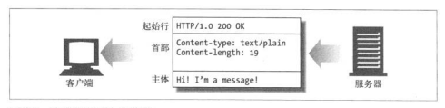

## HTTP

### HTTP 报文结构

#### 组成部分

HTTP 报文由三个部分组成,对报文进行描述的起始行,包含属性的首部块,以及可选的,包含数据的主体部分。



实体的主体或报文的主体是一个可选的数据块。与起始行和首部不同的是,主体中可以包含文本或二进制数据,也可以为空

所有的 HTTP 报文都可以分为两类: 请求报文和响应报文,请求报文会像 web 服务器请求一个动作。响应报文会将请求的结果返回给客户端。请求和响应报文的基本报文结构相同


这是请求报文的格式

```
<method><reguest-URL><version>
<headers>
<entity-body>
```

这是响应报文的格式

```
<vesion><status-code><reason-phrase>
<headers>
<entity-body>
```

下面是各部分的简要描述

- 方法(method):
  客户端希望服务器对资源执行的动作。是一个单独的词,比如`GET`,`HEAD`或`POST`

- 请求 URL(request-URL):
  命名了所请求资源,或者 URL 路径组件的完整 URL。如果直接与服务器进行对话,只要 URL 的路径组件是资源的绝对路径,通常就不会有什么问题

- 版本(version):
  报文所使用的 HTTP 版本

- 状态码(status-code):
  这三位数字描述了请求过程中所发生的情况。每个状态码的第一位数字都用于描述状态的一般类型('成功', '出错')

- 原因短语(reason-phrase):
  数字状态码的可读版本,包含行终止序列之前的所有文本。

- 首部(header):
  可以有零个或多个首部,每个首部都包含一个名字,后面跟着一个冒号(:),然后是一个可选的空格,接着是一个值,最后是一个空行

- 实体的主体部分
  实体的主体部分包含一个由任意数据组成的数据块,并不是所有的报文都包含实体的主体部分。


#### 方法

HTTP 定义了一组被称为安全方法的方法。`GET`方法和`HEAD`方法都被认为是安全的,这就意味着使用`GET`或`HEAD`方法的 HTTP 请求都不会产生什么动作。不产生动作,在这里意味着 HTTP 请求不会在服务器上产生什么结果。

- GET:
  `GET`方法是最常用的方法。通常用于请求服务器发送某个资源。
- HEAD:
  `HEAD`方法与`GET`方法的行为很类似,但服务器在响应中只返回首部。不会返回实体的主体部分。这就允许客户端在未获取的实际资源的情况下,对资源的首部进行检查。使用`HEAD`,可以

  - 可以在不获取资源的情况下了解资源的情况(比如,判断其类型)
  - 通过查看响应中的状态码,看看某个对象是否存在
  - 通过查看首部,测试资源是否被修改了

- PUT:
  与`GET`从服务器读取文档相反,`PUT`方法会向服务器写入文档。有些发布系统允许用户创建`Web`页面,并用`PUT`直接将其安装到`Web`服务器上。

- POST:
  POST 方法起初是用来向服务器输入数据的。实际上,通常会用它来支持`HTML`的表单。表单中填好的数据通常会被传送给服务器,然后由服务器将其发送到它要去的地方。

- TRACE：
  客户端发起一个请求时,这个请求可能要穿过防火墙,代理,网关或其它一些应用程序。每个中间节点都可能会修改原始的`HTTP`请求。`TRACE`方法允许客户端在最终将请求 发送给服务器时。看看它变成什么什么样子
- OPTIONS:
  `OPTIONS`方法请求 Web 服务器告知其支持的各种功能。可以询问服务器通常支持哪些方法,或者对某些特殊资源支持那些方法。(有些服务器可能只支持对一些特殊类型的对象使用特定的操作)
- DELETE:
  `DELETE`方法所作的事情就是请服务器删除请求 URL 所指定的资源。但是,客户端应用程序无法保证删除操作一定会被执行。因为 HTTP 规范允许服务器在不通知客户端的情况下撤销请求。

#### GET 和 POST 区别

- 作用:
  GET 用于获取资源,而 POST 用于传输实体主体
- 参数:
  GET 和 POST 的请求都能使用额外的参数,但是 GET 的参数是以查询字符串出现在 URL 中,而 POST 的参数存储在实体主体中
- 安全
  安全的 HTTP 方法不会改变服务器状态,也就是说他只是可读的
  GET 方法是安全的,而 POST 却不是,因为 POST 的目的是传送实体主体内容,这会导致服务器状态的改变
- 幂等性:
  幂等的 HTTP 方法,同样的请求被执行一次与连续执行多次的效果是一样的。服务器的状态也是一样的。换句话说,幂等方法不应该具有副作用(统计用途除外),在正确实现的条件下,`GET`,`HEAD`, `PUT` 和`DELETE`方法都是幂等的,而`POST`方法也是幂等的。
- 可缓存:
  如果要对象响应进行缓存,需要满足以下条件

  - 请求报文的 HTTP 报文本身是可缓存的,包括 GET 和 HEAD,但是 PUT 和 DELETE 不可缓存,POST 方法在大多数情况下不可缓存
  - 响应报文的状态码是可缓存的,包括: 200, 203, 204, 206, 300, 301, 404, 405, 410, 414, and 501。
  - 响应报文的`cache-Control`首部字段没有执行不进行缓存

#### 状态码

| 状态码 |               类别               |          原因短语          |
| :----: | :------------------------------: | :------------------------: |
|  1XX   |  Informational（信息性状态码）   |     接收的请求正在处理     |
|  2XX   |      Success（成功状态码）       |      请求正常处理完毕      |
|  3XX   |   Redirection（重定向状态码）    | 需要进行附加操作以完成请求 |
|  4XX   | Client Error（客户端错误状态码） |     服务器无法处理请求     |
|  5XX   | Server Error（服务器错误状态码） |     服务器处理请求出错     |

- 1XX 信息
  - 100 continue: 请求的初始部分已收到,但未被服务器拒绝,服务器打算在请求完全收到并采取行动后发送最终响应
- 2XX 成功
  - 200 ok
  - 203 not-authoritative infomation: 请求是成功的,但封装的有效载荷已经源服务器的`200 ok`响应中变换代理了
  - 204 no content: 服务器已成功完成请求,并且在响应内容主体中没有其他内容要发送,主要用于保存动作的文档编辑界面一起使用
  - 206 partial content: 服务端通过传送与请求的范围请求找到可满足范围对应的一个或多个部分。
- 3XX 重定向:
  - 301 moved permanently: 目标资源已经被分配一个新的永久性 URL,响应的中的`Location`字段,包含新的永久 URI 的首选 URL 引用。用户可以通过使用`Location`进行自动重定向
  - 302 found: 目标资源暂时驻留在不同的 URL 下,由于重定向有时可能会发生变化,因此客户端将继续使用老的 URL 以用于将来的请求
  - 303 see other: 客户端应该用另一个 URL 来获取资源,新的 URL 位于响应报文的`Location`首部,其主要目的时允许`POST`请求的响应将客户端定向到某个资源上。
  - 304 Not Modifed: 客户端请求包含有条件的首部,如果满足条件返回`200 ok`响应,如果不满足条件返回`304`
  - 307 Temporary Redirect: 与 301 状态码类似,但客户端应该使用`Location`首部给出的`URL`来临时定位资源,将来的请求应该使用老的 URL。与 302 的不同之处在于,他不允许将请求方法从`POST`更改为`GET`。
- 4XX 客户端错误:
  - 400 bad request: 错误的客户端请求
  - 401 unauthorized: 该请求没有被应用,因为他们没有有针对目标资源的有效认证
  - 403 forbidden: 服务器拒绝请求
  - 404 not found: 服务器找不到所请求的 URL
- 5XX 服务端错误
  - 500 internal server error: 服务器出现问题,无法响应请求
  - 503 service unavailable: 由于临时加载或维护,服务器当前无法处理该请求,在延迟后可能会缓解该请求

#### 首部

- 通用首部:
  有些首部提供了与报文相关的最基本信息,他们被称为通用首部。

  |       首部        |                                     描述                                      |
  | :---------------: | :---------------------------------------------------------------------------: |
  |    Connection     |                  允许客户端和服务器指定与请求/响应有关的选项                  |
  |       Date        |                  提供日期和时间标志,说明报文是什么时间创建的                  |
  |      Trailer      | 如果报文采用了分块传输编码方式,就可以用这个首部列出位于报文拖挂部分的首部集合 |
  | Transfer-Encoding |           告知接收端为了保证报文的可靠传输,对报文采用了什么编码方式           |
  |      Update       |                 给出了发送端可能想要升级使用的新版本或新协议                  |
  |        Via        |                     显示了报文经过的中间节点(代理和网关)                      |
  |   Cache-control   |                            用于随报文传送缓存指示                             |
  |      Pragma       |                  另一种随报文传送指示的方式,但并不专用于缓存                  |

- 请求首部:
  请求首部是只在请求报文中有意义的首部。用于说明是谁或什么在发送请求。
  | 首部 | 描述 |
  | :--: | :--: |
  | client-ip | 提供了运行客户端的机器的 IP 地址 |
  | From | 提供客户端用户的 E-mail 的地址 |
  | Host | 给出了接收请求的服务器的主机名和端口号 |
  | Referer | 提供了包含当前请求 URI 的文档的 URL |
  | UA-Color | 提供了与客户端显示器的显示颜色有关的信息 |
  | UA-CPU | 给出了客户端 CPU 的类型或制造商 |
  | UA-Disp | 提供了与客户端显示器能力有关的信息 |
  | UA-OS | 给出了运行在客户端及其上的操作系统名称及版本 |
  | UA-Pixels | 提供了客户端显示器的像素信息 |
  | User-Agent | 将发起请求的应用程序名称告知服务器 |
  | Accept | 告诉服务器能够发送那些媒体信息 |
  | Accept-Charset | 告诉服务器能够发送那些字符集 |
  | Accept-Encoding | 告诉服务器能够发送那些编码方式 |
  | Accept-Language | 告诉服务器能够发送那些语言 |
  | Tg | 告诉服务器可以使用那些扩展传输编码 |
  | Expect | 允许客户端列出某请求所要求的服务器行为 |
  | if-Match | 如果实体标记与文档当前的实体标记相匹配,就获取这份文档 |
  | if-Modeified-Since | 除非在某个指定的日期之后资源被修改后,否则就限制这个请求 |
  | if-None-Match | 如果提供的实体标记与当前文档的实体标记不相符,就获取文档 |
  | if-Range | 允许对文档某个范围进行条件请求 |
  | if-Unmodified-Since | 除非在某个指定日期之后资源没有被修改过,否则就限制这个请求 |
  | Range | 如服务器支持范围请求,就请求资源的指定范围 |
  | Authorization | 包含了客户端提供给服务器,一边对其自身进行认证的数据 |
  | Cookie | 客户端用他向服务器传送一个令牌 |

- 响应首部:
  响应首部为客户端提供了一些额外信息
  | 首部 | 描述 |
  | :--: | :--: |
  | Age | 响应持续时间 |
  | Public | 服务器为其 i 资源支持的请求方法列表 |
  | Retry-After | 如果资源不可用的话,在此日期或时间重试 |
  | Accept-Range | 对此资源来说,服务器可接受的范围类型 |
  | Set-Cookie | 可以在客户端设置一个令牌,以便服务器对客户端进行标识 |
- 实体首部
  用来描述 HTTP 报文的负荷
  | 首部 | 描述 |
  | :--: | :--: |
  | Allow | 列出了可以对此实体执行的请求方法 |
  | Location | 告知客户端实体实际上处于何处 |
  | Content-Length | 主体的长度或尺寸 |
  | Content-MD5 | 主体的 MD5 校验和 |
  | ETag | 与此实体相关的实体标记 |
  | Exprise | 实体不在有效,要从原始的源端再次获取实体的日期和时间 |
  | Last-Modified | 这个实体最后一个被修改的日期和时间 | 
