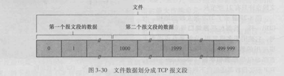
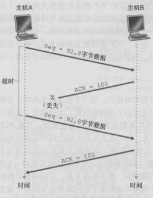
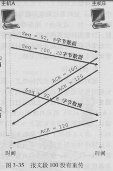
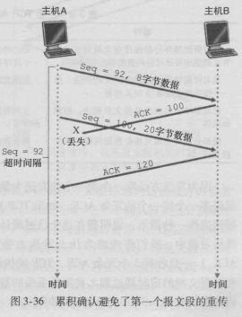
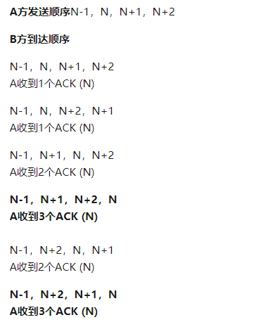
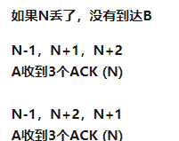
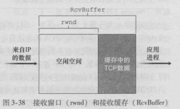
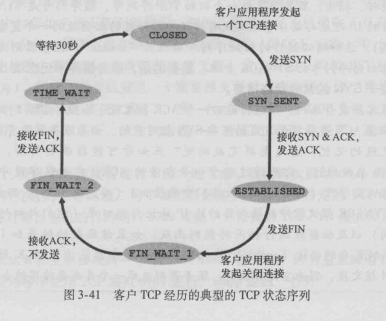

## TCP

### UDP 和 TCP 的区别

- 关于何时,发送什么数据的应用层控制更为精细:

采用 UDP 时,只要应用进程将数据传递给 UDP,UDP 就会将此数据打包进 UDP 报文端并立即将其传递给网络层。而相对于 TCP 来说因为有拥塞控制机制,以便当源和目的主机件的一条或多条链路变得极度拥塞时来遏制运输层发送方。

- 无须连接的建立:
  TCP 在开始数据传输之前要经过三次握手，UDP 却不需要任何准备即可进行数据传输。

- 无连接状态:

TCP 需要在端系统中维护连接状态。此连接状态包括接收和发送缓存,拥塞控制参数以及序号为确认号的参数。而 UDP 并不需要维护连接状态,也不跟踪这些参数。

- 分组首部开销小:

每个 TCP 报文段都有 20 字节的首部开销,而 UDP 仅有 8 字节的开销

### TCP 可靠数据传输

TCP 报文端首部中两个最重要的字段是序号字段和确认号字段。这两个字段是 TCP 可靠传输服务的关键服务。他们两个字段放置的是传送的字节流之上,而不是建立在传送的报文段的序列上。一个报文段的序号因此是该报文段首字节的字节流编号。例如一个数据流包含 500000 字节的文件组成,其 MSS 为 1000 字节,数据流的首字节编号是 0,该 TCP 将为该数据流构建 500 个报文端。给第一个报文段分配序号 0,第二个报文端分配序号 1000,第三个报文端分配序号 2000。以此类推

现在我们要考虑确认号。因为 TCP 是全双工的,因此主机 A 在向主机 B 发送数据的同时,也许也接收来自主机 B 的数据(都是同一 TCP 连接的一部分)。从主机 B 到达的每个报文段中都有一个序号用于从 B 流向 A 的数据。主机 A 填充进报文段的确认号是主机 A 期望从主机 B 收到的下一字节的序号。这样就会保证数据不会乱序

可靠性通过发送方检测到丢失的传输数据并重传这些数据,包括超时机制外,还使用冗余确认技术。

TCP 发送方有三个有 3 个发送和重传有关的主要事件:

- 从上层应用程序接收数据:

TCP 从应用程序接收数据,将数据封装在一个报文段中,并把该报文端封装在一个报文段中,并把该报文段交给 IP。如果定时器还没有为某些其他报文段而与运行,则当报文段被传给 IP 时,TCP 就启动该定时器

- 超时:

TCP 通过重传引起超时的报文段来响应超时事件。然后 TCP 重启定时器

- 收到 ACK:

当接收方的确认字段到达,TCP 将 ACk 的值 Y 于他的变量 SendBase(最早未被确认的字节的序号)进行比较。如果 y>SendBase,则该 ACK 是在确认一个或多个先前未被确认的报文端,因此发送方更新它的 SendBase 变量;如果当前有未被确认的报文段。TCP 还要重新启动定时器。这就是累积确认。

下面介绍几种微妙的情况,看看 TCP 是怎样处理的

- 第一种情况:

我们发现主机 B 发往主机 A 的确认报文丢失了。在这种情况下,超时事件就会发生,主机 A 会重传相同的报文段。当然主机 B 会通过序号发现报文段包含了已收到的数据,因此会丢弃这些重传的报文段中的这些字节

- 第二种情况:

我们现在假设主机 B 的两个确认报文没有一个到达主机 A。当超时事件发生时,主机 A 重传序号 92 的第一个报文段并重启定时器。只要第二个报文段的 ACK 在新的超时发生以前到达,则第二个报文段将不会重传。

- 第三种情况:

与第二种情况一样,发送两个报文端。第一个报文段的确认报文在网络丢失,但在超时事件发生之前主机 A 收到一个确认号为 120 的确认报文。主机 A 因而知道主机 B 已经收到了序号为 119 及之前的所有字节,所以主机 A 不会重传这两个报文段中的任何一个。

#### 快速重传

超时触发重传存在的问题之一是超时周期可能相对较长。当一个报文段丢失时,这种长超时周期迫使发送方延迟重传丢失的分组,因而增加了端到端时延。幸运的是,发送方通常可在超时事件发生之前通过注意所谓冗余 ACK 来较好的检测到丢包情况。
当接收方接收到发送方的序号大于下一个所期望的,按序的报文端,他检测到了报文段的丢失。因为 TCP 不使用否定确认,所以他只是对已经接收到的最后一个按序字节数据进行重复确认(即产生一个冗余 ACK)即可

为什么是三次:

假如 N 不丢失,只是乱序

加入 N 丢失

因此乱序有`40%`概率导致收到 3 次冗余 ACK,而闭包会`100%`收到三次 ACK

### 流量控制

TCP 连接每一个主机都为该连接设置了接收缓存。当该 TCP 连接收到正确,按序的字节后,他将数据放入接收缓存。流量控制用来避免主机分组发送得过快而使接收方来不及完全收下导致接收缓存移除，一般由接收方通告给发送方进行调控。

TCP 通过让发送方维护一个称为接收窗口的变量来提供流量控制,接收窗口用于给发送方一个只是——该接收方还有多少可用的缓存空间,因为 TCP 是全双工通信的,在连续两端的发送方都个自维护一个接收窗口。

假设主机 A 通过一条 TCP 都各自维护一条 TCP 连接向主机 B 发送一个大文件。主机 B 为该连接分配了一个接收缓存,并用`RevBuffer`来表示其大小。主机 B 上的应用进程不时地从该缓存中读取数据。我们定义以下变量:

- LasrByteRead: 主机 B 上的应用进程从缓存读出的数据流的最后一个字节的编号
- LastByteRevd: 从网络中到达的并且已放入主机 B 接收缓存中的数据流的最后一个字节的编号

由于 TCP 不允许已分配的缓存溢出,所以必须满足规则:
`LastByteRevd - LastByteRead <= RevBuffer`
接收窗口用`rwnd`表示,根据缓存可用空间的数量来设置：

`rwnd = RevBuffer - [LastByteRevd - LastByteRead]`

主机 B 通过把当前的`rwnd`值放入它发给主机 A 的报文段接收窗口字段中,通知主机 A 它在该连接的缓存中还有多少可用空间。不过有一个特殊情况:
假设主机 B 的接收缓存已经存满,使得`rwnd = 0`,将`rwnd = 0`通告给主机后,还要假设主机 B 没有任何数据要发给主机 A。这时主机 B 上的应用进程将缓存清空,TCP 并不像主机 A 发送带有`rwnd`新值的新报文段: 事实上,TCP 仅当在他有数据或有确认要发时才会发送报文段给主机 A,这样 A 不可能知道 B 的接收缓存已经有新的空间了。即主机 A 被阻塞不能在发送任何数据。因此 TCP 规定: 当主机 B 的接收窗口为 0 时,主机 A 继续发送只有一个字节数据的报文端,这些报文段会被接收方确认,最终缓存将开始清空,并且确认报文里将包含一个非 0 的`rwnd`值

### 连接管理

- 建立连接(三次握手)

1.  客户端通过服务器端发送一个`SYN`(值为 1)来创建一个主动连接,客户端把这段连接的序号设定为随机数`A`
2.  服务器端应当为一个合法的`SYN`回送一个`SYN(值为1)/ACK`。`ACK`的确认码应为`A + 1`,`SYN/ACK`包本身又有一个随机产生的序号`B`
3.  最后,客户端在发送一个`ACK`。当服务器端收到这个`ACK`时候,就完成了三次握手,并进入了连接创建状态。此时包的序号被设定为收到的确认号`A + 1`,而确认号为`B + 1`。`SYN`被置为 0。

- 断开连接(四次挥手)

1.  客户端发送关闭连接命令,发送含有标识`FIN`的特殊报文段(被设置为 1)
2.  当服务器去接收到该报文端。就向发送方会送一个确认报文端
3.  之后服务器发送他自己的终止报文端,其`FIN`比特被置为 1
4.  最后客户端对这个服务器的终止报文段进行确认,此时两台主机用于连接都被释放了

#### TCP 运行状态

在一个 TCP 连接的声明周期内,运行在每台主机中的 TCP 协议在各种`TCP`状态之间变迁。

- 客户端 TCP 状态序列:

1.  CLOSED: 无连接状态
2.  SYN_SENT: 客户在发送连接请求后等待匹配的连接请求,通过向服务器发送一个`SYN`报文段进入此状态
3.  ESTABLISHED: 服务器与客户端的连接已经打开了,收到的数据可以发送给用户,数据传输步骤的正常情况。此时连接两端是平等的,这称之为全连接
4.  FIN-WAIT-1: 客户端选择关闭连接,将发送`FIN`报文段,表示客户端的数据发送全部结束,等待服务器的`ACK`确认包
5.  FIN-WAIT-2: 客户端在`FIN-WAIT-1`状态下收到`ACK`确认包,进入等待远程 TCP 的连接终止请求的半关闭状态。这时可以接收数据,但不再发送数据
6.  TIME-WAIT: 客户端接收到`FIN`,就发送`ACK`包,等待足够时间以确保服务器收到了终止请求的确认包。如果`ACK`丢失,`TIME-WAIT`使 TCP 重传最后的确认报文

- 服务端状态序列:

1.  CLOSED: 无连接状态
2.  LISTEN: 服务器等待从任意远程`TCP`端口的连接请求,侦听状态。
3.  SYN-RCVD: 服务器已经收到`SYN`之后等待确认`ACK`请求
4.  ESTABLISHED: 全连接状态
5.  CLOSE-WAIT: 服务器端收到`FIN`后,就发出`ACK`回应`FIN`请求,并进入等待本地用户的连接终止请求的半关闭状态,这时可以发送数据,但不再接收数据
6.  LAST-ACK: 服务器端全部数据发送完后,向客户端发送`FIN`,进入等待确认包的状态。

#### 为什么需要三次握手

为了防止已失效的连接请求突然又传送到了服务端,因而产生错误。例如,客户端发出的第一个连接请求报文端并没有丢失,而是再某个网络结点长时间滞留,导致厌恶到连接释放以后的某个时间才到达服务器。由于现在客户端没有发出连接的请求,因此不会理睬服务端的去确认,所以服务端的资源就会白白浪费掉。

#### 为什么需要四次挥手

因为 TCP 时全双工通信的,所以当客户端提出了连接释放请求,只是客户端到服务端的连接释放了,然而服务端到客户端的连接还没有段,服务端还是可以向客户端发送数据。当数据发送完毕则释放连接,如果没有数据,则过一段时间释放连接

### 拥塞控制
