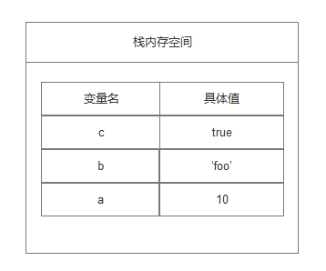
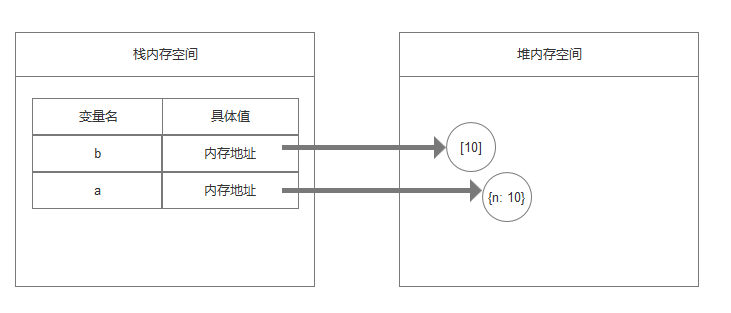
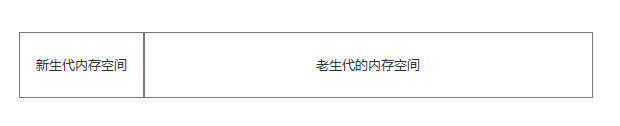
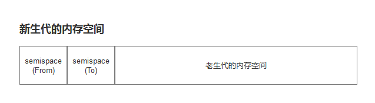
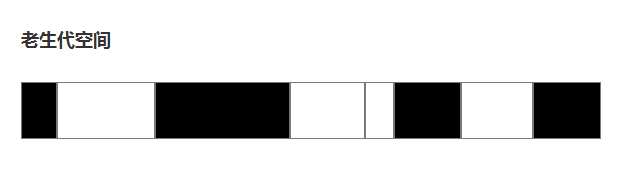
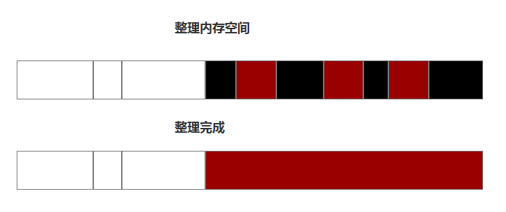

## 内存管理

### 概览:

在 JavaScript 中不向 C 语言中拥有`malloc()`和`free()`这样的内存管理函数来去管理和释放操作系统的内存,js 拥有自己的垃圾回收机制,帮助开发者来管理这一切。但是某些时候因为开发者的无意为之的代码,导致内存泄漏。所以我们应该要对内存管理有一定的了解。

### JS 内存模型

在 JavaScript 中有两种内存模型,一个是栈内存,另一个是堆内存

- 基本数据类型和栈内存:

在 JavaScript 中基本类型都有固定的内存大小,当编译器编译代码的时候,编译器会检查基本类型,并且计算和分配他们的内存到栈的数据结构中去。分配这些变量的空间我们称之为栈内存,因为随着函数的调用,新的内存会被加在现有的内存上,当他们终止的时候,他们以后进先出的顺序被移除,例如

```
let a = 10;
let b = 'foo';
let c = 'true';
```



- 引用类型和堆内存

刚才的基本类型值,系统会帮我们计算并分配内存值,但是像对象或数组这种引用类型,编译器不知道他们到底需要多少内存,因为他是由用户提供的值来决定的。因此我们不能在栈内存中去分配空间,我们需要在程序运行的时候明确像系统请求正确的内存量,这个内存是堆空间分配的,因此我们去在堆内存中去存取引用类型的数据,不过对引用类型的引用是存储在栈内存中的。

```
let a = [10];
let b = {
  n: 10
}
```



### 内存生命周期

无论哪种程序语言,内存生命周期总是大致相同的。

- 内存分配: 内存由操作系统分配,它允许你的应用程序使用。JavaScript 帮你完成这些了。
- 内存使用: 这是你程序真正使用之前分配的内存的时候,读写操作在你使用代码中已分配的变量发生。
- 内存释放: 释放你明确不需要的内存,让其再次空闲和可用。和内存分配一样,JavaScript 帮你处理了。

### 垃圾回收机制

在自动垃圾回收的演变过程中,人们发现没有一种垃圾回收算法去解决所有场景带来的问题。因此使用不同的算法针对不同的场景会有最好的效果。因此现代的垃圾回收算法会按对象的存活时间将内存的垃圾回收进行不同的分代。然后分别对不同的分代进行不同的垃圾回收算法。



- Scavenge 算法

在分代的基础上,新生代中的对象主要通过 `Scavenge` 算法进行垃圾回收。其主要采用一复制的方式实现的垃圾回收算法,将堆内存一分为二,每一部分空间称为 `semispace`。在这两个 `semispace` 空间中,只有一个处于使用中,另一个处于闲置状态。处于使用状态的 `semispace` 称为 `From` 空间,处于闲置状态的称为 `To` 空间。当我们分配内存时,先是在`From`空间中进行分配。当开始进行垃圾回收时,会检查`From`空间中的存活对象,这些存活对象将被复制到`To`空间中,而非存活对象占用的空间将会被释放。完成复制后,`From`空间和`To`空间的角色发生对换。



当我们在将`From`空间中的对象在复制到`To`空间之前需要进行检查。在一定条件下,需要将存活周期长的对象移动到老生代中,也就是完成对象晋升。

对象晋升条件有两个:

1.  对象是否经历过`Scavenge`回收
2.  `To`空间的内存内存占用比超过`25%`

- Mark-Sweep 和 Mark-Compact

对于老生代的对象,因此 V8 会采用`Mark-Sweep`和`Mark-Compact`相结合的方式进行垃圾回收。`Maark-Sweep`是标记清除的意思,它分为两个标记和清除两个阶段。`Mrak-Sweep`在标记阶段遍历堆中的所有对象,并标记活着的对象,在随后的清除阶段中,只清除没有被标记的对象。



不过`Mark-Sweep`最大的问题是进行一次标记清除回收后,内存空间会出现不连续的状态,这种内存碎片会对后续的内存分配造成问题。因此`Mark-compact`被提出来,他们的差别在于对象在标记为死亡后,在整理的过程中,将活着的对象往一端移动,移动完后,直接处理掉边界外的内存。如下图所示,白色格子为存活对象,黑色格子为死亡对象,棕色格子为存活对象移动后留下的空洞。



上面所说的是垃圾回收的内存处理,那`Mark-Sweep`是怎么标记存活对象的呢？`Mark-Sweep`一般会经过这三个步骤来确定对象是否存活

1.  根节点: 一般来说根是代码中引用的全局变量,例如,在 JavaScript,全局变量是`window`对象。`Node.js`中的全局对象被称为`global`完整的根节点列表是由垃圾收集器构建
2.  然后算法检查所有根节点和他们的子节点并且把他们标记为存活对象(意思是他们不是死亡对象),任何根节点不能访问的变量会被标记为死亡对象
3.  垃圾收集器释放所有死亡对象的内存,并将这些内存返回给操作系统


- 引用计数垃圾收集

这是最简单得垃圾收集算法。如果有零个执行它得引用,则该对象被认为是可垃圾回收。但是这里有个问题,如果两个对象互相引用,则不会被垃圾回收

```
function foo(){
  let o1 = {};
  let o2 = {};
  o1.x = o2;
  o2.x = o1;
}
```

但在采用标记清除得策略中,因为离开了作用域,因此这种相互引用就不是问题

### JavaScript 常见得四种内存泄露

1.  全局变量:

在 JavaScript 用一种有趣的方式处理未声明的变量:当引用一个未声明的变量的时候,会在全局对象下创建一个新变量。

```
function foo(){
  bar = 'some text'
}

// 等同于

function foo(){
  window.bar = 'some text'
}
```

如果我们在函数作用域中不声明它,就会创建一个冗余的全局变量。另外我们也可以用`this`意外的创建一个全局变量

```
function foo(){
  this.bar = 'some text'
}

foo();

console.log(window.bar); // 'some text';
```

2.  被忘记的定时器或者回调函数
    我们以常见的事件处理函数为例

```
var element = document.getElementById('launch-button');
var counter = 0;
function onClick(event) {
   counter++;
   element.innerHtml = 'text ' + counter;
}
element.onClick = onClick;
```

我们为一个元素的点击事件绑定了一个匿名函数，我们通过`event`参数是可以拿到相应元素`element`的信息的。这是不是就是一个循环引用呢？
`element`有一个属性`onclick`引用了一个函数（其实也是个对象），函数里面的参数又引用了`elment`，这样`elment`的引用次数一直是 2，即使当前这个页面关闭了，也无法进行垃圾回收。
幸运的是，大多数现代浏览器都拥有拥有事件处理机制的观察者,即使你忘记删除监听器，当观察对象无法访问的时候,他们也会自动收集事件观察者处理程序。
但是,我们还是有必要去移除事件观察者

```
var element = document.getElementById('launch-button');
var counter = 0;
function onClick(event) {
   counter++;
   element.innerHtml = 'text ' + counter;
}
element.addEventListener('click', onClick);
// Do stuff
element.removeEventListener('click', onClick);
```

现在的浏览器支持检测这些循环并适当地处理它们的垃圾收集器，因此在制造一个无法访问的节点之前，你不再需要调用 `removeEventListener`。

3.  闭包
    javaScript 开发的一个关键方面是闭包：一个内部函数可以访问外部（封闭）函数的变量。由于 JavaScript 运行时的实现细节，可能以如下方式泄漏内存：

```
var theThing = null;
var replaceThing = function () {
  var originalThing = theThing;
  var unused = function () {
    if (originalThing) // a reference to 'originalThing'
      console.log("hi");
  };
  theThing = {
    longStr: new Array(1000000).join('*'),
    someMethod: function () {
      console.log("message");
    }
  };
};
setInterval(replaceThing, 1000);
```

一旦调用了`replaceThing` 函数，`theThing` 就得到一个新的对象，它由一个大数组和一个新的闭包（someMethod）组成。然而 `originalThing` 被一个由 `unused` 变量（这是从前一次调用 `replaceThing` 变量的 `theThing` 变量）所持有的闭包所引用。需要记住的是一旦为同一个父作用域内的闭包创建作用域，作用域将被共享。

在这个例子中，`someMethod` 创建的作用域与 `unused` 共享。`unused` 包含一个关于 `originalThing` 的引用。即使 `unused` 从未被引用过，`someMethod` 也可以通过 `replaceThing` 作用域之外的 `theThing` 来使用它（例如全局的某个地方）。由于 `someMethod` 与 `unused` 共享闭包范围，`unused` 指向 `originalThing` 的引用强制它保持活动状态（两个闭包之间的整个共享范围）。这阻止了它们的垃圾收集。

4.  DOM 超出引用

有些情况下开发人员在数据结构中存储 DOM 节点。假设你想快速更新表格中几行的内容。如果在字典或数组中存储对每个 DOM 行的引用，就会产生两个对同一个 DOM 元素的引用：一个在 DOM 树中，另一个在字典中。如果你决定删除这些行，你需要记住让两个引用都无法访问。

```
var elements = {
    button: document.getElementById('button'),
    image: document.getElementById('image')
};
function doStuff() {
    elements.image.src = 'http://example.com/image_name.png';
}
function removeImage() {
    // The image is a direct child of the body element.
    document.body.removeChild(document.getElementById('image'));
    // At this point, we still have a reference to #button in the
    //global elements object. In other words, the button element is
    //still in memory and cannot be collected by the GC.
}
```

在涉及 DOM 树内的内部节点或叶节点时，还有一个额外的因素需要考虑。如果你在代码中保留对表格单元格（td 标记）的引用，并决定从 DOM 中删除该表格但保留对该特定单元格的引用，则可以预见到严重的内存泄漏。你可能会认为垃圾收集器会释放除了那个单元格之外的所有东西。但情况并非如此。由于单元格是表格的子节点，并且子节点保持对父节点的引用，所以对表格单元格的这种单引用会把整个表格保存在内存中。
